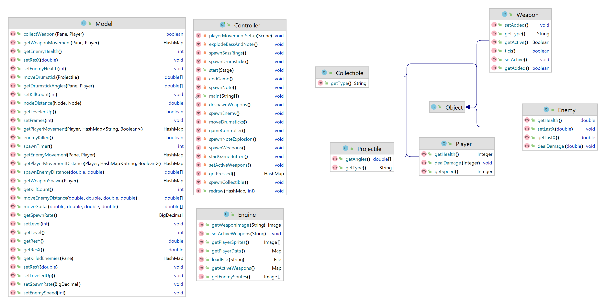
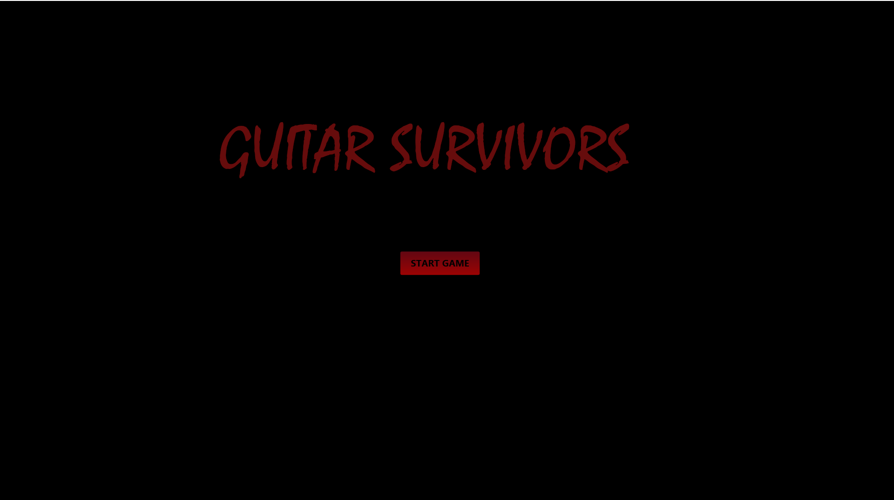
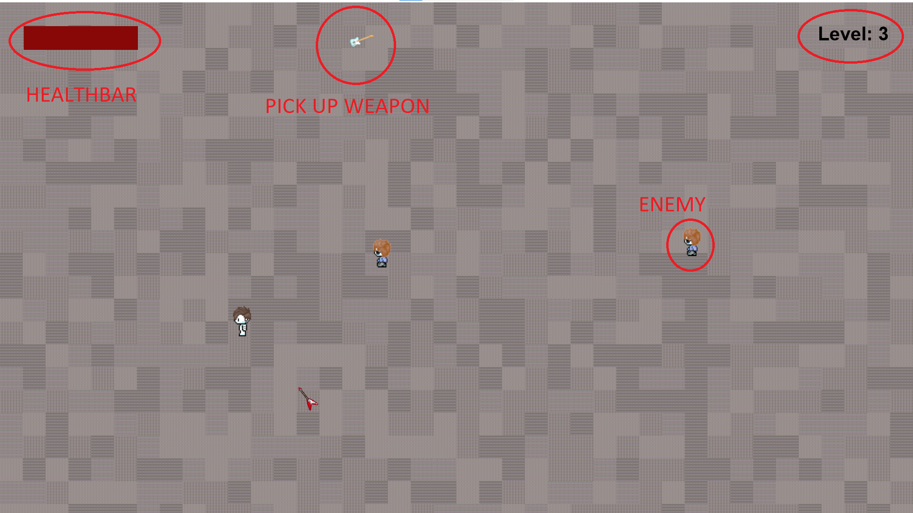
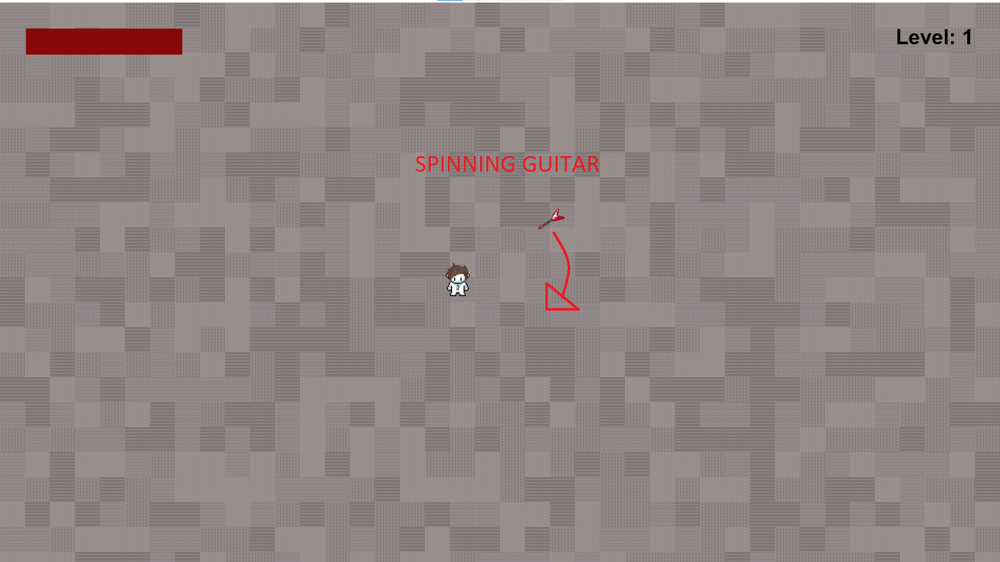
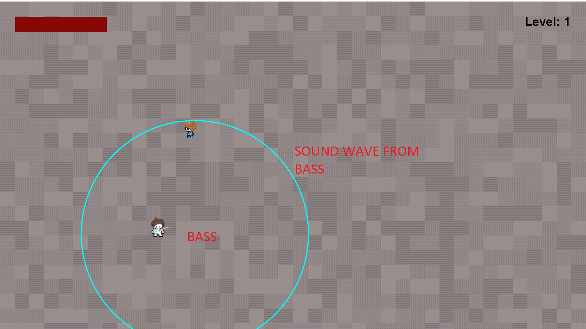
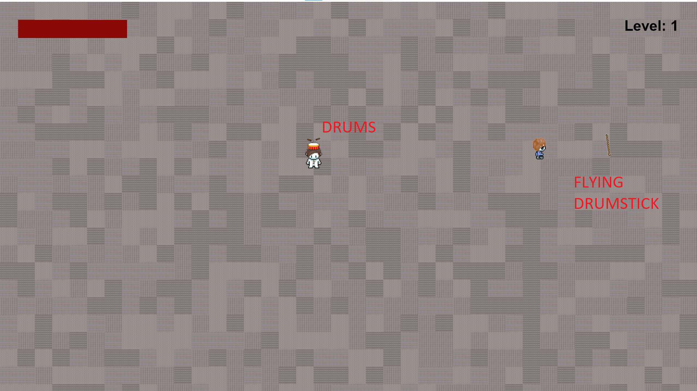
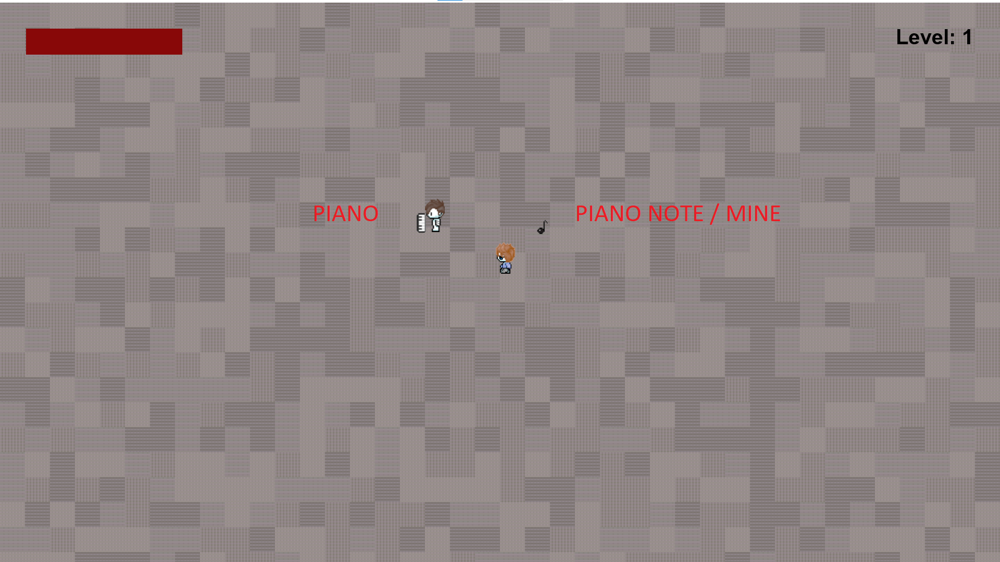
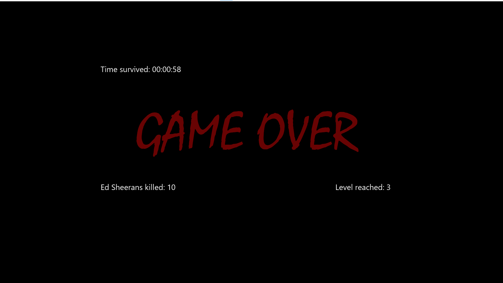
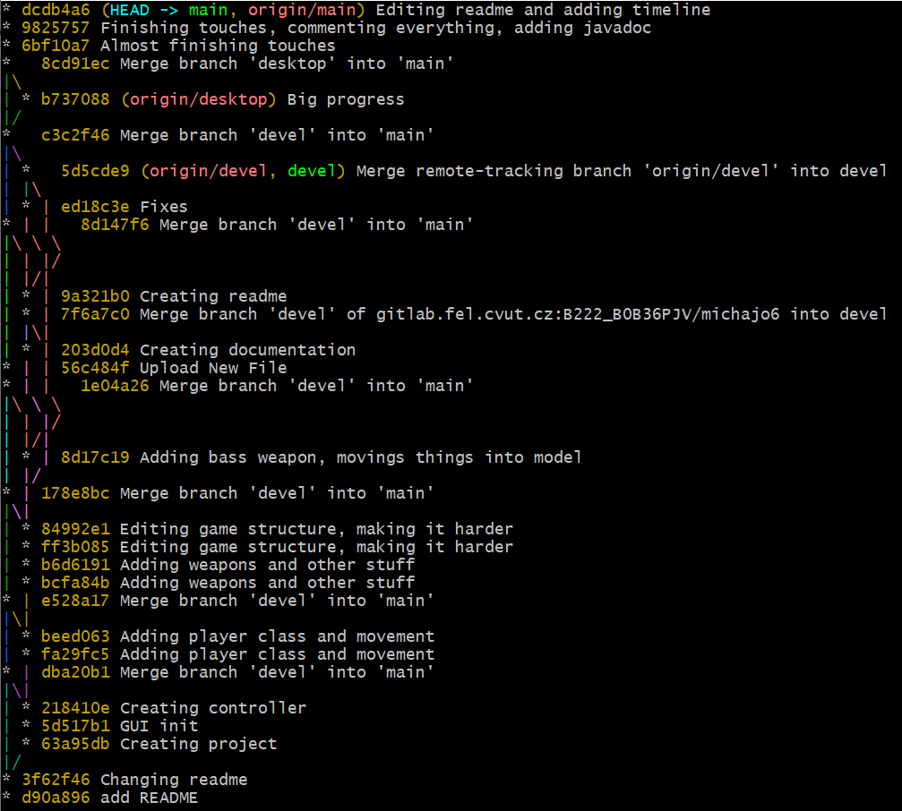

#  Guitar Survivors
### (A Vampire Survivors remake)

**Subject:** B0B36PJV

**Author:** Josef Michálek

## About the engine

Guitar Survivors is a game or a game engine inspired by the famous game Vampire
Survivors. My main motivation to create this game was enjoying the original game
itself and wanting to create something along the likes of it, but with some changes.

For those who don't know anything about the original game: The main objective is to
survive the longest and kill the most enemies. To kill enemies you can obtain multiple
different kinds of weapons.

The main way I wanted to distinguish my game from the original was to change the 
theme from dark vampires to guitars and music and make it more dynamically satisfying.

## User manual

The user manual for this game is quite straightforward. 

The 'only' in-game inputs go as follows:

* Pressing the "Start game" button in the beginning
* Using W, S, A, D to move the character

The project folder also has a folder 'files' which includes two json files.

* activeWeapons.json
  * The weapons that are set to 'true' at the start of the game will be the weapons the
  player starts with (A player can have all weapons equipped at once)

* player.json
  * This file contains configuration info about the player, that can be set to different
  values, according to how difficult a player wants to make the game for himself.

* Logger
  * Controller class contains a private boolean 'logger' which if set to true makes sure the game is being logged into the console.

## Documentation

### Classes:

#### Controller (The main class, that handles all javafx stuff)
* Main methods:
  * **startGameButton()** &#8594; Handles the start of the game, calls other methods 
  * **gameController()** &#8594; Contains an animation timer. Is the place where all methods are called
  * **redraw()** &#8594; Handles all redrawing in the pane.
  * **endGame()** &#8594; When the player dies, this method is called. It erases everything
  from the main pane and gives the player a screen with stats

* Methods called from redraw, as they were too long:
  * **playerMovementSetup()** &#8594; Sets up player movement
  * **explodeBassAndNote()** &#8594; Handles bass shock-waves and note explosions
  * **spawnBassRings()** &#8594; Spawns bass rings every n ticks
  * **spawnDrumsticks()** &#8594; Spawns drumsticks from weapon drums
  * **spawnNote()** &#8594; Spawns note from weapon piano
  * **despawnWeapons()** &#8594; Removes all weapons of same type from pane when one of them is picked up
  * **spawnEnemy()** &#8594; Spawns an enemy every n frames at the start, decreasing every level
  * **moveDrumsticks()** &#8594; Moves drumsticks every frame with the starting angle being towards
           the closest enemy
  * **spawnNoteExplosion()** &#8594; Spawns explosion for a note after n ticks
  * **spawnWeapons()** &#8594; Spawns active weapons if their position is irregular (spinning guitar)
  * **setActiveWeapons()** &#8594; Sets which weapons are active according to 
        activeWeapons.json
  * **spawnCollectible()** &#8594; Spawns weapon on the map to be collected by the player

* Other:
  * **getPressed()** &#8594; Returns a map of pressed keys to be used in model
  * **logger()** &#8594; Logs important info into console

#### Object (Class that extends ImageView, is the source class for all drawn things on screen)

* Extended classes:
  * **Player**
  * **Enemy**
  * **Weapon**
  * **Projectile**
  * **Collectible**

#### Engine (Class that handles all file stuff)

* Important methods:
  * **getActiveWeapons()** &#8594; Gets active weapons from activeWeapons.json
  * **loadFile()** &#8594; A method used many times, loads a file from 'file' folder
  * **getWeaponImage()** &#8594; Gets a weapon sprite based on the type of weapon
  * **getPlayerData()** &#8594; Gets player data from player.json
  * **getEnemySprites()** &#8594; Gets enemy sprites
  * **getPlayerSprites()** &#8594; Gets player sprites
  * **setActiveWeapons()** &#8594; Writes active weapons to activeWeapons.json

#### Model (Class that handles all variables and counting)

* Player:
  * **collectWeapon()** &#8594; If player is close enough to a collectible weapon, he pickes it up
  * **getPlayerMovement()** &#8594; Calculates new coordinates for player to move
* Weapons:
  * **getWeaponMovement()** &#8594; Gets data for weapons to move
  * **moveDrumsticks()** &#8594; Calculates coordinates for drumsticks to move
  * **getDrumstickAngles()** &#8594; Calculates angles in which drumsticks will be moving
  * **getWeaponSpawn()** &#8594; Calculates random x and y coordinates for a collectible weapon to
    spawn on, so that it spawns outside the player's radius (more than 100px)
  * **moveGuitar()** &#8594; Helper for _getWeaponMovement()_ to calculate coordinates for guitar
* Enemy:
  * **getEnemyMovement()** &#8594; Calculates the x and y numbers to move the enemy an
    exact amount of pixels towards the player
  * **spawnEnemyDistance()** &#8594; Calculates random x and y coordinates for an enemy to
    spawn on, so that it spawns outside the player's radius (more than 100px)
  * **moveEnemyDistance()** &#8594; Helper for _getEnemyMovement()_ to calculate required numbers
  * **getKilledEnemies()** &#8594; Gets list of all enemies that are at or below 0hp
* Other:
  * **nodeDistance()** &#8594; Calculates the distance between 2 nodes
  * **moveGuitar()** &#8594; Calculates the x and y numbers to move the player's guitar
  in a circle around him at all times

## UML Diagram

## Game visuals

## Project tree

    |-- README.md
    |-- guitar_survivors
    |   |-- files
    |   |   |-- activeWeapons.json
    |   |   `-- player.json
    |   |-- guitar_survivors.iml
    |   |-- mvnw
    |   |-- mvnw.cmd
    |   |-- pom.xml
    |   |-- src
    |   |   |-- main
    |   |   |   |-- java
    |   |   |   |   |-- cz
    |   |   |   |   |   `-- cvut
    |   |   |   |   |       `-- fel
    |   |   |   |   |           `-- pjv
    |   |   |   |   |               `-- guitar_survivors
    |   |   |   |   |                   |-- Collectible.java
    |   |   |   |   |                   |-- Controller.java
    |   |   |   |   |                   |-- Enemy.java
    |   |   |   |   |                   |-- Engine.java
    |   |   |   |   |                   |-- Model.java
    |   |   |   |   |                   |-- Object.java
    |   |   |   |   |                   |-- Player.java
    |   |   |   |   |                   |-- Projectile.java
    |   |   |   |   |                   `-- Weapon.java
    |   |   |   |   `-- module-info.java
    |   |   |   `-- resources
    |   |   |       `-- cz
    |   |   |           `-- cvut
    |   |   |               `-- fel
    |   |   |                   `-- pjv
    |   |   |                       `-- guitar_survivors
    |   |   |                           |-- files
    |   |   |                           |   `-- player.json
    |   |   |                           `-- images
    |   |   |                               |-- end.png
    |   |   |                               |-- enemy_sprites
    |   |   |                               |   |-- enemy0.png
    |   |   |                               |   |-- enemy1.png
    |   |   |                               |   |-- enemy2.png
    |   |   |                               |   `-- enemy3.png
    |   |   |                               |-- icon.png
    |   |   |                               |-- level.png
    |   |   |                               |-- player_sprites
    |   |   |                               |   |-- sprite (1).png
    |   |   |                               |   |-- sprite (10).png
    |   |   |                               |   |-- sprite (11).png
    |   |   |                               |   |-- sprite (12).png
    |   |   |                               |   |-- sprite (2).png
    |   |   |                               |   |-- sprite (3).png
    |   |   |                               |   |-- sprite (4).png
    |   |   |                               |   |-- sprite (5).png
    |   |   |                               |   |-- sprite (6).png
    |   |   |                               |   |-- sprite (7).png
    |   |   |                               |   |-- sprite (8).png
    |   |   |                               |   `-- sprite (9).png
    |   |   |                               |-- sources.txt
    |   |   |                               |-- start.png
    |   |   |                               `-- weapon_sprites
    |   |   |                                   |-- bass.png
    |   |   |                                   |-- drums.png
    |   |   |                                   |-- drumstick.png
    |   |   |                                   |-- guitar.png
    |   |   |                                   |-- note.png
    |   |   |                                   `-- piano.png
    |   |   `-- test
    |   |       `-- cz
    |   |           `-- cvut
    |   |               `-- fel
    |   |                   `-- pjv
    |   |                       `-- guitar_survivors
    |   |                           `-- ModelTest.java
    |   `-- target
    |       |-- classes
    |       |   |-- cz
    |       |   |   `-- cvut
    |       |   |       `-- fel
    |       |   |           `-- pjv
    |       |   |               `-- guitar_survivors
    |       |   |                   |-- Collectible.class
    |       |   |                   |-- Controller$1.class
    |       |   |                   |-- Controller$2.class
    |       |   |                   |-- Controller$3.class
    |       |   |                   |-- Controller.class
    |       |   |                   |-- Enemy.class
    |       |   |                   |-- Engine$1.class
    |       |   |                   |-- Engine$2.class
    |       |   |                   |-- Engine$3.class
    |       |   |                   |-- Engine.class
    |       |   |                   |-- Model.class
    |       |   |                   |-- Object.class
    |       |   |                   |-- Player.class
    |       |   |                   |-- Projectile.class
    |       |   |                   |-- Weapon.class
    |       |   |                   |-- files
    |       |   |                   |   `-- player.json
    |       |   |                   `-- images
    |       |   |                       |-- end.png
    |       |   |                       |-- enemy_sprites
    |       |   |                       |   |-- enemy0.png
    |       |   |                       |   |-- enemy1.png
    |       |   |                       |   |-- enemy2.png
    |       |   |                       |   `-- enemy3.png
    |       |   |                       |-- icon.png
    |       |   |                       |-- level.png
    |       |   |                       |-- player_sprites
    |       |   |                       |   |-- sprite (1).png
    |       |   |                       |   |-- sprite (10).png
    |       |   |                       |   |-- sprite (11).png
    |       |   |                       |   |-- sprite (12).png
    |       |   |                       |   |-- sprite (2).png
    |       |   |                       |   |-- sprite (3).png
    |       |   |                       |   |-- sprite (4).png
    |       |   |                       |   |-- sprite (5).png
    |       |   |                       |   |-- sprite (6).png
    |       |   |                       |   |-- sprite (7).png
    |       |   |                       |   |-- sprite (8).png
    |       |   |                       |   `-- sprite (9).png
    |       |   |                       |-- sources.txt
    |       |   |                       |-- start.png
    |       |   |                       `-- weapon_sprites
    |       |   |                           |-- bass.png
    |       |   |                           |-- drums.png
    |       |   |                           |-- drumstick.png
    |       |   |                           |-- guitar.png
    |       |   |                           |-- note.png
    |       |   |                           `-- piano.png
    |       |   `-- module-info.class
    |       |-- generated-sources
    |       |   `-- annotations
    |       |-- generated-test-sources
    |       |   `-- test-annotations
    |       `-- test-classes
    |           `-- cz
    |               `-- cvut
    |                   `-- fel
    |                       `-- pjv
    |                           `-- guitar_survivors
    |                               `-- ModelTest.class
    |-- guitar_survivors.png
    `-- package cz.cvut.fel.pjv.java

## Git timeline

